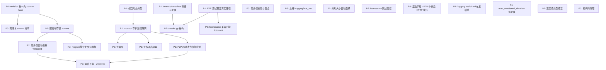

# llmpt-client 开发路线图

注意本项目使用uv管理python环境，本地存在.venv目录

## 依赖关系总览

---

## P0 — 基础保障（不需要大改动，但影响全局正确性）

### ~~0.1 · 服务端 `/api/v1/health` 端点~~ ✅
- **已完成**：服务端 `web-server` 和 `tracker` 均已注册 `/api/v1/health`（复用 `/health` handler）。

---

## P1 — 高优先级（核心正确性 & 阻塞其他工作）

### ~~1.1 · revision 统一为 commit hash~~ ✅
- **已完成**：
  - `utils.py` 新增 `resolve_commit_hash()` —— 通过 `HfApi.repo_info()` 将分支名/标签解析为 40 字符 commit hash，带进程内缓存
  - `patch.py`：`_patched_hf_hub_download` 在存储 P2P 上下文前解析 revision（失败时 gracefully fallback 为原始值）
  - `cli.py`：`cmd_seed` 在创建 torrent 和注册前解析 revision
  - `torrent_creator.py`：`create_and_register_torrent` 使用 snapshot 路径中的实际 commit hash 进行注册（defense-in-depth）
  - `session_context.py`：移除了 "hash lookup failed → retry with main" 的 workaround
  - **服务端** `publish.go`：新增 commit hash 格式校验（拒绝非 40 字符 hex 的 revision）
  - **服务端** `torrents.go`：`ListTorrents` 支持 `revision` 查询参数（之前仅支持 `repo_id`）
  - **客户端** `tracker_client.py`：`get_torrent_info` 将 revision 作为服务端查询参数传递（之前为客户端本地过滤）
- **阻塞**：跨版本 swarm 共享 (3.1)、服务端存储 .torrent (2.1) 都依赖 revision 语义的明确性

### ~~1.2 · 端口动态分配~~ ✅
- **现状**：`p2p_batch.py` 第 46 行硬编码 `listen_interfaces = '0.0.0.0:6881'`。
- **问题**：
  - 同一台机器无法运行多个 llmpt 实例（测试、多用户场景）
  - 6881 是知名 BT 端口，某些 ISP/防火墙会封锁
- **方案**：
  1. 默认使用 `0.0.0.0:6881,[::]:6881`，若 bind 失败则自动尝试 6882-6999
  2. 或直接使用 `0.0.0.0:0` 让 OS 分配随机端口
  3. 支持通过环境变量 `HF_P2P_PORT` 或 `enable_p2p(port=...)` 覆盖

### ~~1.3 · timeout / metadata 等待时间可配置化~~ ✅
- **已完成**：
  - metadata 等待 8s 提取为 `METADATA_TIMEOUT` 常量（支持环境变量 `LLMPT_METADATA_TIMEOUT` 覆盖）
  - recheck 硬超时 120s **移除**（做种场景不应有硬超时，400GB 模型在 HDD 上需要 40+ 分钟，改为无限等待 + 进度日志）
  - seed init timeout 30s **移除**（发现是死代码：`self.timeout` 只在 `download_file()` 中使用，做种路径从不调用）
  - P2P 整体 per-file timeout 300s 保留当前设计，但识别出需要改进 → 见 2.11
- ~~**现状**~~：
  - ~~P2P 整体 timeout 已可配置（`enable_p2p(timeout=300)`），✅~~
  - ~~但 metadata 等待时间硬编码为 8 秒（`session_context.py` L143）~~
  - ~~seeding 的 register timeout 硬编码为 30 秒（`p2p_batch.py` L67）~~
  - ~~recheck timeout 硬编码为 120 秒（`session_context.py` L345）~~
- ~~**方案**：将这些超时统一纳入 `_config` 字典或作为 `SessionContext` 的构造参数，允许通过环境变量或 API 覆盖~~

### 1.4 · E2E 测试应覆盖真实用户路径，而非绕过公共接口调用内部函数
- **现状**：用户使用 llmpt 有两条入口路径，但 E2E 测试都没有完整覆盖：
  - **CLI 路径**：`llmpt-cli seed` / `llmpt-cli download` — 未通过 CLI 入口测试
  - **API 路径**：`enable_p2p()` → `snapshot_download()` — 下载端走了这条路，但做种端没有
  - `run_seeder.py` 直接调用了 `TrackerClient`、`P2PBatchManager`、`create_and_register_torrent` 等内部类来拼装做种流程，绕过了 `llmpt-cli seed` 或 `seeder.start_seeding()` 的真实路径
  - `test_docker_p2p.py` 断言时直接访问 `P2PBatchManager().sessions` 内部状态，而非通过公共 API（如 `get_download_stats()`）验证
- **问题**：这样测试的是内部组件的拼装，而不是用户实际使用时的行为。如果 CLI 或公共 API 的封装层有 bug，E2E 测试发现不了。
- **方案**：
  1. 做种端应通过 CLI 命令（`llmpt-cli seed --repo-id xxx --revision main`）或公共 API（`seeder.start_seeding()`）驱动
  2. 下载端应保持当前的 `enable_p2p()` → `snapshot_download()` 路径（已正确）
  3. 断言应通过公共接口（`get_download_stats()`、`get_seeding_status()`）而非内部状态验证

### 1.5 - logging.basicConfig 不应在库中调用
- **现状**：`__init__.py` L28-31 调用了 `logging.basicConfig(level=logging.INFO, ...)`。
- **问题**：这是 Python 库的严重反模式。`basicConfig()` 会覆盖用户应用程序自己的日志配置。用户 `import llmpt` 后，整个应用的日志格式和级别都被静默修改。
- **方案**：
  1. 移除 `logging.basicConfig()` 调用
  2. 改为 `logger.addHandler(logging.NullHandler())`（Python 官方推荐的库日志实践）
  3. 让用户在自己的应用中决定日志的级别和格式

### 1.6 - auto_seed 和 seed_duration 是死配置
- **现状**：`enable_p2p(auto_seed=True, seed_duration=3600)` 接受这两个参数并存入 `_config`，但整个代码库没有任何地方读取 `_config['auto_seed']` 或 `_config['seed_duration']` 来执行实际逻辑。
- **问题**：用户以为设置了自动做种1小时，实际上完全无效，造成误导。
- **方案**：
  - **方案 A**：实现它们 - 下载完成后根据 auto_seed 自动调用 start_seeding，根据 seed_duration 设置定时器停止
  - **方案 B**：先从 API 中移除，在文档中说明做种需要手动通过 CLI 触发，避免误导用户

---

## P2 — 中优先级（功能增强 & 架构改善）

### 2.1 · 服务端存储 .torrent 文件 / 添加缓存
- **现状**：tracker 只存储 magnet link 等元数据。客户端拿到 magnet link 后需要先下载 torrent metadata（等待其他 peer 提供），这有 8 秒超时风险。
- **方案**：
  1. `create_and_register_torrent()` 在注册时把 `torrent_data`（bencode 后的完整 torrent 文件）一并上传给 tracker
  2. Tracker 提供 `/api/v1/torrents/<id>/torrent` 端点返回 .torrent 文件
  3. 客户端优先下载 .torrent 文件直接初始化（跳过 metadata 等待阶段），fallback 到 magnet link
- **收益**：消除 metadata 等待超时（当前最常见的失败原因之一）

### 2.2 · 服务端自动做种 (Webseed 前提)
- **现状**：做种完全依赖已有用户的客户端持续运行。如果没人在线做种，新用户的 P2P 请求 100% 失败。（客户关闭huggingface_hub后仍可以做种的解决方案）
- **方案**：
  1. Tracker 服务端收到 torrent 注册后，自动启动一个做种进程
  2. 利用原始 HF Hub HTTP URL 作为 webseed（BEP 17/19），让 libtorrent 在没有 peer 时从 HF 官方 HTTP 拉取
  3. 服务端做种可以保证 swarm 永远有至少一个 seed
- **依赖**：需要 revision = commit hash (1.1) 以及 .torrent 存储 (2.1)

### 2.3 · magnet link 携带扩展元数据
- **现状**：magnet link 只含 info_hash 和 tracker announce URL。
- **方案**：在 tracker 返回的 JSON 中增加：
  - `total_size`（已有字段，但客户端未使用）→ 用于磁盘预分配和用户提示
  - `file_list` → 包含每个文件的大小，用于客户端预判磁盘空间
  - `piece_length` → 客户端可决定是否适合当前网络环境
- **注意**：这不是修改 magnet link 本身（magnet URI 格式有限），而是丰富 tracker API 返回的元数据

### 2.4 · 分片大小 (piece_length) 自动选择
- **现状**：`torrent_creator.py` 默认 16MB piece_length。`utils.py` 有 `get_optimal_piece_length()` 函数但未被使用！
- **问题**：
  - 16MB 对小文件（<100MB）过大，导致单 piece 包含多个文件，无法精细地按文件优先级下载
  - 对 100GB+ 的超大模型可能需要更大 piece
- **方案**：在 `create_torrent()` 中调用 `get_optimal_piece_length(total_size)` 而非硬编码

### 2.5 · seeder.py 重构
- **现状**：`seeder.py` 直接操作 `P2PBatchManager` 的内部状态（`manager.sessions`、`manager._lock`、`manager.lt_session`），严重违反封装。
- **方案**：
  1. 将 `stop_seeding()`、`stop_all_seeding()`、`get_seeding_status()` 的逻辑迁移到 `P2PBatchManager` 内部作为方法
  2. `seeder.py` 变成薄封装层，只做 API 转发
  3. 或者直接取消 `seeder.py`，将其功能合并到 `P2PBatchManager`
- **依赖**：测试重构 (1.4) 作为安全网

### 2.6 · monitor 守护进程与 session 解耦
- **现状**：每个 `SessionContext` 启动一个独立的 monitor 线程（`session_context.py` L138）。如果同时下载 N 个仓库就有 N 个 monitor 线程。
- **问题**：线程数量不可控，且所有 monitor 都独立调用 `lt_session.pop_alerts()`，可能导致 alert 被错误消费（一个 session 的 monitor 拿到了另一个 session 的 alert，处理后丢弃，导致目标 session 永远收不到该 alert）
- **方案**：
  1. 单个全局 monitor 线程，由 `P2PBatchManager` 管理
  2. Monitor 遍历所有活跃 session，统一 pop alert 后分发到对应 session
  3. 支持 session 动态注册/注销
- **依赖**：端口动态分配 (1.2)

### 2.7 · fastresume 兼容旧版 libtorrent
- **现状**：`session_context.py` L111 有版本判断 `hasattr(lt.add_torrent_params, "parse_resume_data")`，但实现不完整——旧版 API 分支没有实际加载 resume data 的代码。
- **方案**：
  1. 对 lt < 1.2：使用 `params.resume_data = resume_data` 的旧接口
  2. 对 lt >= 2.0：使用 `lt.read_resume_data()`
  3. 添加单元测试 mock 两种版本

### ~~2.8 · 通过缓存 fastresume 或后台预生成跳过验证阶段~~ ✅
- **已完成**：采用比原方案更优的 **hardlink + seed_mode** 方案：
  - 在 libtorrent 期望的路径创建硬链接指向 HF blob，然后启用 `seed_mode`
  - 0 秒启动（每次都是，不只是第 2 次），libtorrent 在 peer 请求时按需验证 SHA1
  - 跨文件系统时自动 fallback 到 legacy `rename_file()` + `force_recheck()`
  - 做种停止后自动清理硬链接（`_cleanup_seeding_hardlinks()`）
  - 下载路径的 `_deliver_file()` 也增加了源文件清理，避免 p2p_root 残留
- ~~**原方案**~~：
  - ~~注册做种后，保存 fastresume data（包含已校验的 piece 状态）~~
  - ~~下次启动时加载 fastresume 跳过 recheck~~
  - ~~或后台预先计算 piece hash 并缓存~~

### 2.9 - 进程退出时优雅清理
- **现状**：没有 atexit 或 signal handler。进程退出时未保存最终的 fastresume 数据，libtorrent session 未正常关闭（不会向 tracker 发送 stopped 事件），临时文件未清理。
- **方案**：
  1. 注册 `atexit.register()` 回调，在进程退出时保存 fastresume、关闭 lt_session
  2. 捕获 SIGTERM/SIGINT 信号做同样的清理
  3. 在 P2PBatchManager 中添加 `shutdown()` 方法供手动调用

### 2.10 - create_and_register_torrent 返回值类型不一致
- **现状**：类型标注为 `-> bool`，但实际返回 torrent_info (dict) 或 None。`run_seeder.py` 依赖它返回 dict（`torrent_info['torrent_data']`）。
- **方案**：修正类型标注为 `-> Optional[dict]`，或统一返回值语义

### 2.11 - P2P 下载超时改为基于进度的卡顿检测
- **现状**：`download_file()` 使用固定 `timeout=300s` 的 `event.wait()`。300s 对 50GB 文件太短（50MB/s 需要 1000s），对卡住的下载又太长（白等 5 分钟）。超时后 fallback HTTP 会丢弃所有已下载数据（`_truncate_temp_file`）。
- **问题**：固定超时无法区分"P2P 在努力下载但文件太大"和"P2P 完全卡住没有进展"
- **方案**：改为"如果连续 N 秒没有新数据下载，才放弃 P2P"（stall detection）
  1. monitor 线程追踪 per-file 的字节进度变化
  2. 如果 `STALL_TIMEOUT`（如 60s）内 `file_progress[i]` 没有增长，视为卡住
  3. 只要有进展，就不超时——大文件可以安心下载
- **收益**：大文件不再被错误中断；卡住的下载更快 fallback；WebSeed (3.2) 实现后此机制自然兼容

---

## P3 — 低优先级（长期规划 & 高复杂度）

### 3.1 · 跨版本 swarm 共享
- **问题**：同一模型的两个版本（如 v1.0 和 v1.1）可能 90% 的文件完全相同，但处于不同 swarm，无法互相提供 piece。
- **可能方案**：
  - **方案 A**：Tracker 返回相关 swarm 信息，客户端同时加入多个 torrent
  - **方案 B**：利用 BT v2 的 per-file Merkle hash 实现文件级去重。但 libtorrent Python bindings 对 v2 的支持不成熟（pad 文件问题已验证）
  - **方案 C**：Tracker 维护文件级索引（file hash → 哪些 torrent 包含该文件），客户端从多个 torrent 拼凑
- **依赖**：revision = commit hash (1.1)
- **复杂度**：极高，需要 tracker 和客户端深度配合

### 3.2 · 混合下载 — WebSeed
- **概念**：利用 BEP 17/19，在 torrent 中嵌入 HF Hub 的 HTTP URL 作为 web seed。当没有 peer 可用时，libtorrent 自动从 HTTP 源下载 piece。
- **好处**：P2P 的效率 + HTTP 的可靠性，消除"无 seed 可用"的问题
- **实现**：在 `create_torrent()` 中 `t.add_url_seed(hf_download_url)` 
- **挑战**：HF Hub 的 URL 中包含 token 和 commit hash，需要正确构造 per-file URL
- **依赖**：服务端 .torrent 存储 (2.1) + 服务端自动做种 (2.2)

### 3.3 · 混合下载 — P2P 中断后 HTTP 续传
- **概念**：P2P 超时后启动 HTTP fallback 时，不从头下载，而是从 P2P 已下载的 offset 继续。
- **现状**：`patch.py` 在 fallback 时 `_truncate_temp_file()` 把已下载数据清零，传 `resume_size=0` 重新开始。
- **挑战**：
  - BT 是 piece-based 乱序下载，HTTP 是顺序流式。已下载的 piece 可能不连续，无法简单用 `Range: bytes=offset-` 续传
  - 需要将已完成的 piece 数据按顺序重组写入 temp_file
- **复杂度**：高，ROI 可能不如 webseed

### 3.4 · 进度条
- **现状**：下载进度只通过 logger 输出（每 5 秒一次 STATUS 日志）。
- **方案**：
  1. 使用 `tqdm`（已在依赖中）显示每文件下载进度
  2. 需要 monitor 线程将进度数据暴露给主线程
  3. 可以通过回调函数或共享状态实现
- **依赖**：monitor 解耦 (2.6)，因为进度数据需要从全局 monitor 中获取

### 3.5 · 服务端校验与安全
- **范围**：
  - 注册 torrent 时校验：info_hash 是否与 torrent 数据匹配、文件哈希是否与 HF Hub 一致
  - 防止恶意 torrent 注册（伪造 magnet link 分发恶意文件）
  - 客户端下载完成后校验文件 hash 是否与 HF Hub metadata 一致
- **方案**：Tracker 可调用 HF Hub API 验证 repo_id + revision 的真实性，或要求注册时提供签名

### 3.6 · 支持 huggingface_xet
- **现状**：`enable_p2p()` 直接禁用 Xet 引擎（`HF_HUB_DISABLE_XET=1`），强制所有文件走 `http_get` 以被 monkey patch 拦截。
- **长期方案**：
  - 不禁用 Xet，而是也对 `xet_get` 做 monkey patch
  - 或在 Xet 引擎上层拦截
- **复杂度**：Xet 是 HuggingFace 的内容寻址存储引擎，其下载路径与 HTTP 完全不同，需要深入分析

### 3.7 - 死代码清理
- `TrackerClient.announce()` 方法已标注 unused，libtorrent 内部自动处理 announce，可以移除
- 如果确认不会使用，清理掉以减少维护负担

---

## 版本规划建议

| 版本 | 包含内容 | 目标 |
|---|---|---|
| **v0.2** | P0 全部 + P1 全部 (1.1~1.6) | 核心正确性，日志/API 规范化 |
| **v0.3** | P2.1 ~ P2.5 | 服务端增强，架构改善 |
| **v0.4** | P2.6 ~ P2.10 | 架构解耦，性能优化，代码质量 |
| **v1.0** | P3 选择性实现 | 生产可用，混合下载 |

---

## 已解决 / 存档的设计决策

### torrent v1 vs v2
- **结论**：使用 **v1_only** (`create_torrent.v1_only` flag = 64)
- **原因**：
  - v2/hybrid 模式下 libtorrent Python bindings 依然会生成 `.pad/` 虚拟文件
  - pad 文件不在 HF cache 中，导致做种时 piece hash check 全部失败
  - 已在 `torrent_creator.py` L80 实现并经过 E2E 验证
- **v2 的理论优势**（跨 swarm 文件共享）暂时无法在 Python bindings 中利用
